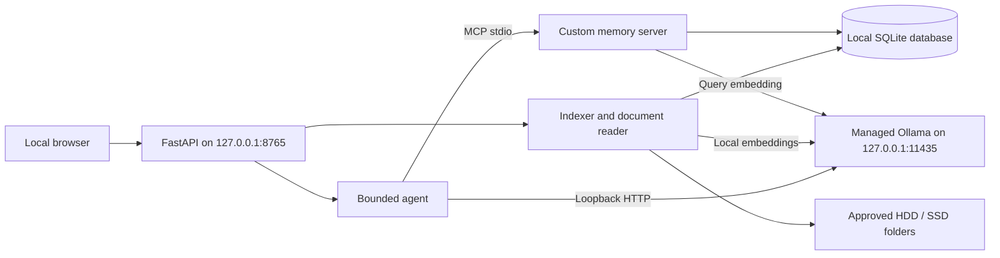

# Architecture

The Windows edition is a native local web UI, Python API, on-device model client, and independent MCP memory service. It uses Windows processes and filesystem APIs without WSL or Docker. One SQLite database contains indexed knowledge, persistent memory, projects, and conversation history. The MCP server uses the official `mcp.server.fastmcp.FastMCP` implementation from the [Python SDK v1 maintenance line](https://py.sdk.modelcontextprotocol.io/v1/).

## Components

| Module | Responsibility |
| --- | --- |
| `copilot/config.py` | Local data directory, persisted settings, loopback endpoint validation |
| `copilot/store.py` | SQLite storage, FTS5 search, vector ranking, projects, memory, conversation history |
| `copilot/library.py` | Folder approval, bounded extraction, incremental indexing, local retrieval |
| `copilot/filesystem.py` | Shared local-path policy, Windows handle validation, source freshness |
| `copilot/ollama.py` | Local model readiness, embeddings, chat, tool-call handling |
| `copilot/mcp_server.py` | Official MCP stdio tools and memory resources |
| `copilot/agent.py` | MCP client, bounded retrieval loop, source context, document summaries |
| `copilot/api.py` | Local REST API, background indexing, explicit memory writes, saved project plans |
| `copilot/static/` | Bundled responsive UI with no external asset dependencies |
| `copilot/windows_runtime.py` and `scripts/*.ps1` / `*.cmd` | Native setup, isolated runtime, process identity, start/stop lifecycle |

The web API and MCP process use `Settings.from_env()` and the same `COPILOT_DATA_DIR`, normally `<checkout>\.local-copilot`. Database connections are opened per operation, with SQLite write-ahead logging allowing normal reads while another process writes. Neither service needs a hosted database. UTF-8 is used for saved settings and project plans.

The launcher downloads the official standalone Windows Ollama runtime into `.runtime\ollama`, stores its models in `.runtime\models`, and isolates it on port 11435 from a tray instance on 11434. Process identity records let start/stop operate only on children belonging to the checkout. The app is foreground by default; it is not installed as a Windows service or configured to start at login.

## Indexing and complete contents

The user first approves an ordinary existing folder on a fixed or removable local drive. The library rejects whole drive roots, Windows system directories, UNC/device namespaces, mapped network drives, the application data directory, overlapping selections, and symbolic links/junctions/reparse points in sources or their ancestors. OneDrive-style placeholders are outside this source policy. Scanning skips hidden entries, dependency/build folders, known credentials, and unsupported formats.

The native reader holds ancestor and file handles while reading, denies write/delete sharing, verifies final handle paths, and checks regular-file, size, and modification-time bounds. It uses Windows [`CreateFileW`](https://learn.microsoft.com/en-us/windows/win32/api/fileapi/nf-fileapi-createfilew) handles and [`GetFinalPathNameByHandleW`](https://learn.microsoft.com/en-us/windows/win32/api/fileapi/nf-fileapi-getfinalpathnamebyhandlew) path validation. This is the Windows source-validation path; the Linux edition on `main` uses its separate `dir_fd` / `O_NOFOLLOW` implementation.

Text and common source-code formats are decoded locally. PDFs use `pypdf` text extraction with page boundaries retained for citations. DOCX extraction reads paragraph and table text from its document XML, including available headers, footers, footnotes, and endnotes. It does not reproduce the original visual layout, images, comments, or embedded media. Files with no extractable PDF text report an OCR limitation.

Limits bound resource consumption: 20 MiB per source file, 20,000 supported files per scan, five million extracted characters per document, and 2,000 pages per PDF. An incomplete traversal retains earlier indexed documents instead of incorrectly deleting files that were not visited. Errors are reported with the offending paths.

Extracted text is retained in full as an indexed snapshot. Chunks use exact character offsets, with a target size of 1,800 characters and 200-character overlap. PDF chunks stay within individual pages. The model sees selected passages or bounded sections; the library's reader and download endpoint expose the complete stored extraction. MCP `read_document` exposes the same contents in character-offset pages.

Source modification time and size determine whether a file needs reindexing. Changed files replace their text and chunks. A successful complete enumeration prunes removed files. A later scan can also add missing embeddings to unchanged documents. Reindex after changing the selected embedding model so documents have matching model-tagged vectors.

## Hybrid retrieval

SQLite FTS5 searches the chunk text. If the local embedding model is ready, document chunks and the question receive local vectors. Cosine similarity ranks model-compatible vectors; reciprocal rank fusion combines semantic and lexical rankings. Retrieval limits the returned evidence and processes vector candidates in bounded batches rather than eagerly building a large Python vector collection.

When embeddings are absent or fail, lexical search remains available. Memory search and saved conversation search are separate from file retrieval, so the assistant can recover a project decision or earlier chat without pretending that it came from a document.

## Agentic RAG

The chat agent opens a real SDK `ClientSession` over stdio, initializes the MCP connection, obtains local evidence and memories, and discovers read-only tool schemas. A local model can request additional searches, document reads, project listings, or searches of earlier conversations. The agent validates tool names and arguments through the MCP server and caps its model/tool loop before final synthesis.

Retrieved documents, saved notes, and past chat messages are marked as untrusted reference material. The built-in agent exposes only read-only MCP tools to the model. It cannot execute a shell command, edit a source file, or turn an instruction embedded in a PDF into an automatic memory write. The Memory and Projects screens make persistent changes through explicit user actions. Chat's `/remember <note>` and `remember that <note>` commands are parsed directly from the current user's message before inference; document contents cannot trigger that path.

The context window is bounded for the laptop. Relevant recent messages, saved project context, and numbered source passages are passed to the model. Whole-document summarization follows all extracted sections with bounded map-and-merge passes rather than taking only the top search hits. Long summaries can take multiple local model calls. The completed response includes a trace of the sections processed; the current request waits for completion and does not stream live section progress.

If the chat model is not ready, chat returns a labeled extractive response with local excerpts. This provides a useful retrieval workflow without presenting source snippets as an AI-generated summary.

## Project creation

A project stores a name, description, and linked explicit memories. Its conversation sessions retain project context. A user-triggered plan opens an actual MCP stdio session and searches indexed knowledge using the project name, description, and request. The local model receives bounded source passages plus project and global memories to draft goals, milestones, architecture, tasks, and acceptance criteria. When sources are found, the saved plan appends a numbered local-reference list with document titles and paths. Assumptions and proposed dates are requested explicitly rather than presented as established source facts.

The API saves the result as `projects\<id>\PLAN.md` under the application data directory. Project planning does not scaffold or execute arbitrary application code.

## Limits of this version

- No OCR, image understanding, audio transcription, or extraction from arbitrary binary formats.
- No background filesystem watcher: rescans are explicit.
- No application-level database encryption or remote multi-user access.
- No automatic source-file edits or shell execution.
- No guarantee that a small local model follows every tool protocol correctly or produces a factually complete summary.
- No measured throughput claim for this laptop; driver, context, and active applications affect memory and speed.

Protocol tests exercise the actual MCP handshake, discovery, tool calls, resource reads, persistent writes, complete-document pagination, and validation of stale sources. Store/library and API/agent tests cover the remaining local behavior without requiring a downloaded model. Native Windows GitHub Actions passed on Windows Server runners with Python 3.12/3.13, including a fake runtime for launcher lifecycle checks. Windows 11 laptop GPU inference remains untested. See the [validation record](validation.md) for the confirmed run and coverage.
